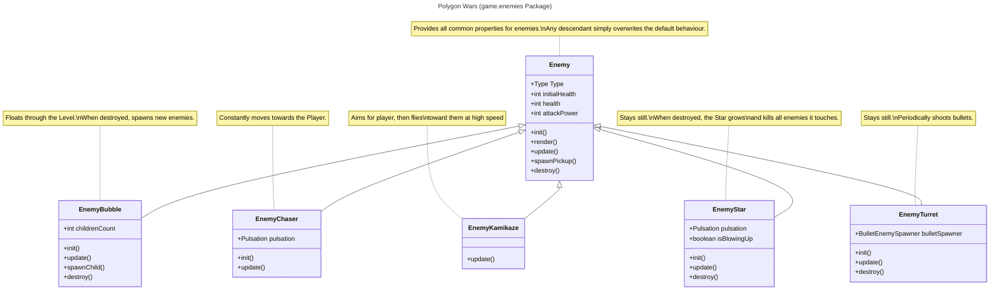

```mermaid
---
title: Polygon Wars (game.enemies Package)
---
classDiagram
    class Enemy {
        +Type Type
        +int initialHealth
        +int health
        +int attackPower

        +init()
        +render()
        +update()
        +spawnPickup()
        +destroy()
    }
    note for Enemy "Provides all common properties for enemies.\nAny descendant simply overwrites the default behaviour."

    class EnemyBubble {
        +int childrenCount

        +init()
        +update()
        +spawnChild()
        +destroy()
    }
    note for EnemyBubble "Floats through the Level.\nWhen destroyed, spawns new enemies."

    class EnemyChaser {
        +Pulsation pulsation

        +init()
        +update()
    }
    note for EnemyChaser "Constantly moves towards the Player."

    class EnemyKamikaze {
        +update()
    }
    note for EnemyKamikaze "Aims for player, then flies\ntoward them at high speed"

    class EnemyStar {
        +Pulsation pulsation
        +boolean isBlowingUp

        +init()
        +update()
        +destroy()
    }
    note for EnemyStar "Stays still.\nWhen destroyed, the Star grows\nand kills all enemies it touches."

    class EnemyTurret {
        +BulletEnemySpawner bulletSpawner

        +init()
        +update()
        +destroy()
    }
    note for EnemyTurret "Stays still.\nPeriodically shoots bullets."
    Enemy <|-- EnemyBubble
    Enemy <|-- EnemyChaser
    Enemy <|-- EnemyKamikaze
    Enemy <|-- EnemyStar
    Enemy <|-- EnemyTurret
```