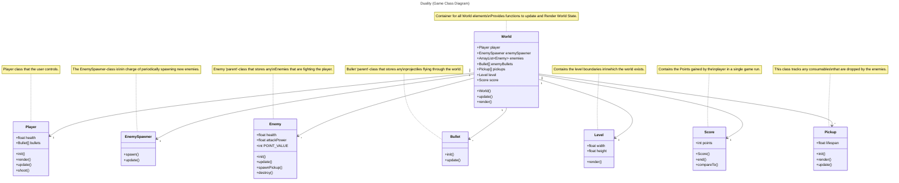

```mermaid
---
title: Duality (Game Class Diagram)
---
classDiagram
class World {
    +Player player
    +EnemySpawner enemySpawner
    +ArrayList~Enemy~ enemies
    +Bullet[] enemyBullets
    +Pickup[] pickups
    +Level level
    +Score score
    +World()
    +update()
    +render()
}
World "1" --> "1" Player
World "1" --> "1" EnemySpawner
World "1" --> "*" Enemy
World "1" --> "*" Bullet
World "1" --> "1" Level
World "1" --> "1" Score
World "1" --> "*" Pickup

note for World "Container for all World elements\nProvides functions to update and Render World State."
note for Player "Player class that the user controls."
class Player {
    +float health
    +Bullet[] bullets
    +init()
    +render()
    +update()
    +shoot()
}

note for EnemySpawner "The EnemySpawner-class is\nin charge of periodically spawning new enemies."
class EnemySpawner {
    +spawn()
    +update()
}

note for Enemy "Enemy 'parent'-class that stores any\nEnemies that are fighting the player."
class Enemy {
    +float health
    +float attackPower
    +int POINT_VALUE
    +init()
    +update()
    +spawnPickup()
    +destroy()
}

note for Bullet "Bullet 'parent'-class that stores any\nprojectiles flying through the world."
class Bullet {
    +init()
    +update()
}

note for Level "Contains the level boundaries in\nwhich the world exists."
class Level {
    +float width
    +float height
    +render()
}

note for Score "Contains the Points gained by the\nplayer in a single game run."
class Score {
    +int points
    +Score()
    +end()
    +compareTo()
}

note for Pickup "This class tracks any consumables\nthat are dropped by the enemies."
class Pickup {
    +float lifespan
    +init()
    +render()
    +update()
}
```
