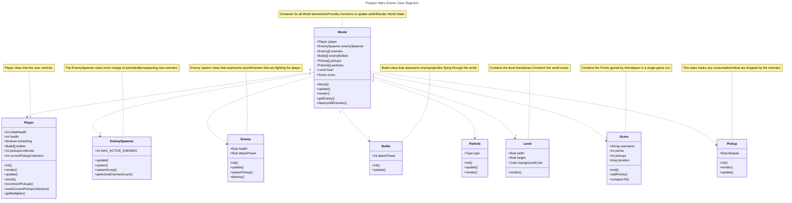

```mermaid
---
title: Polygon Wars (Game Class Diagram)
---
classDiagram
class World {
    +Player player
    +EnemySpawner enemySpawner
    +Enemy[] enemies
    +Bullet[] enemyBullets
    +Pickup[] pickups
    +Particle[] particles
    +Level level
    +Score score

    +World()
    +update()
    +render()
    +getEnemy()
    +destroyAllEnemies()
}
World "1" ..> "1" Player
World "1" ..> "1" EnemySpawner
World "1" ..> "*" Enemy
World "1" ..> "*" Bullet
World "1" ..> "1" Level
World "1" ..> "1" Score
World "1" ..> "*" Pickup
World "1" ..> "*" Particle

note for World "Container for all World elements\nProvides functions to update and\nRender World State."
note for Player "Player class that the user controls."
class Player {
    +int initialHealth
    +int health
    +boolean isDashing
    +Bullet[] bullets
    +int pickupsCollected
    +int currentPickupCollection

    +init()
    +render()
    +update()
    +shoot()
    +incrementPickups()
    +resetCurrentPickupCollection()
    +getMultiplier()
}

note for EnemySpawner "The EnemySpawner-class is\nin charge of periodically\nspawning new enemies."
class EnemySpawner {
    +int MAX_ACTIVE_ENEMIES

    +update()
    +spawn()
    +spawnGroup()
    +getActiveEnemiesCount()
}

note for Enemy "Enemy 'parent'-class that represents any\nEnemies that are fighting the player."
class Enemy {
    +float health
    +float attackPower
    
    +init()
    +update()
    +spawnPickup()
    +destroy()
}

note for Bullet "Bullet-class that represents any\nprojectiles flying through the world."
class Bullet {
    +int attackPower

    +init()
    +update()
}

note for Level "Contains the level boundaries in\nwhich the world exists."
class Level {
    +float width
    +float height
    +Color backgroundColor

    +render()
}

note for Score "Contains the Points gained by the\nplayer in a single game run."
class Score {
    +String username
    +int points
    +int pickups
    +long duration

    +end()
    +addPoints()
    +compareTo()
}

note for Pickup "This class tracks any consumables\nthat are dropped by the enemies."
class Pickup {
    +float lifespan

    +init()
    +render()
    +update()
}

class Particle {
    +Type type

    +init()
    +update()
    +render()
}
```
