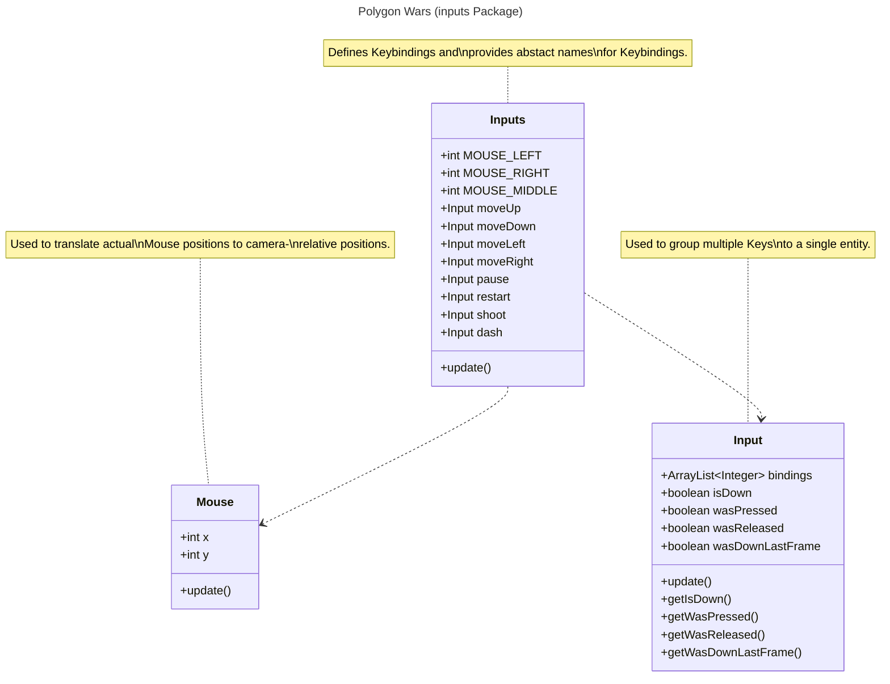

```mermaid
---
title: Polygon Wars (inputs Package)
---
classDiagram
    class Input {
        +ArrayList~Integer~ bindings
        +boolean isDown
        +boolean wasPressed
        +boolean wasReleased
        +boolean wasDownLastFrame

        +update()
        +getIsDown()
        +getWasPressed()
        +getWasReleased()
        +getWasDownLastFrame()
    }
    note for Input "Used to group multiple Keys\nto a single entity."

    class Mouse {
        +int x
        +int y
        
        +update()
    }
    note for Mouse "Used to translate actual\nMouse positions to camera-\nrelative positions."

    class Inputs {
        +int MOUSE_LEFT
        +int MOUSE_RIGHT
        +int MOUSE_MIDDLE
        
        +Input moveUp
        +Input moveDown
        +Input moveLeft
        +Input moveRight
        +Input pause
        +Input restart
        +Input shoot
        +Input dash

        +update()
    }
    Inputs ..> Mouse
    Inputs ..> Input
    note for Inputs "Defines Keybindings and\nprovides abstact names\nfor Keybindings."
```