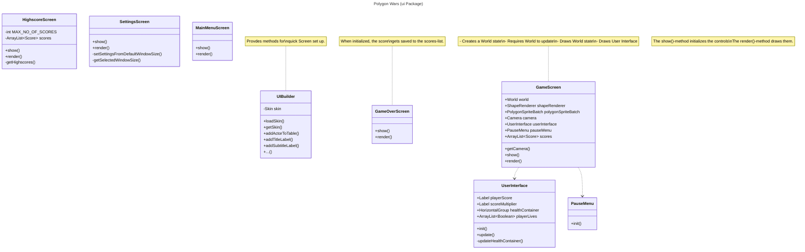

```mermaid
---
title: Polygon Wars (ui Package)
---
classDiagram
    class UserInterface {
        +Label playerScore
        +Label scoreMultiplier
        +HorizontalGroup healthContainer
        +ArrayList~Boolean~ playerLives

        +init()
        +update()
        -updateHealthContainer()
    }

    class PauseMenu {
        +init()
    }

    class UIBuilder {
        -Skin skin

        +loadSkin()
        +getSkin()
        +addActorToTable()
        +addTitleLabel()
        +addSubtitleLabel()
        +...()
    }
    note for UIBuilder "Provdes methods for\nquick Screen set up."

    class HighscoreScreen {
        -int MAX_NO_OF_SCORES
        -ArrayList~Score~ scores

        +show()
        +render()
        -getHighscores()
    }

    class SettingsScreen {
        +show()
        +render()
        -setSettingsFromDefaultWindowSize()
        -getSelectedWindowSize()
    }

    class MainMenuScreen {
        +show()
        +render()
    }

    class GameOverScreen {
        +show()
        +render()
    }
    note for GameOverScreen "When initialized, the score\ngets saved to the scores-list."

    class GameScreen {
        +World world
        +ShapeRenderer shapeRenderer
        +PolygonSpriteBatch polygonSpriteBatch
        +Camera camera
        +UserInterface userInterface
        +PauseMenu pauseMenu
        +ArrayList~Score~ scores

        +getCamera()
        +show()
        +render()
    }
    GameScreen ..> UserInterface
    GameScreen ..> PauseMenu
    note for GameScreen "- Creates a World state\n- Requires World to update\n- Draws World state\n- Draws User Interface"

    note "The show()-method initializes the controls\nThe render()-method draws them."
```