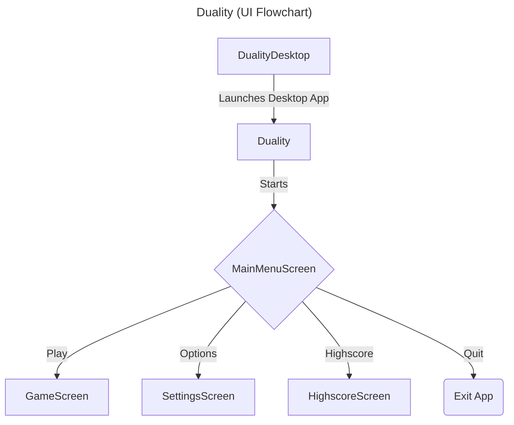

```mermaid
---
title: Duality (UI Flowchart)
---
flowchart TD
    A[DualityDesktop] -->|Launches Desktop App| B[Duality]
    B --> |Starts| C{MainMenuScreen}
    C -->|Play| D[GameScreen]
    C -->|Options| E[SettingsScreen]
    C -->|Highscore| F[HighscoreScreen]
    C -->|Quit| G(Exit App)
```
