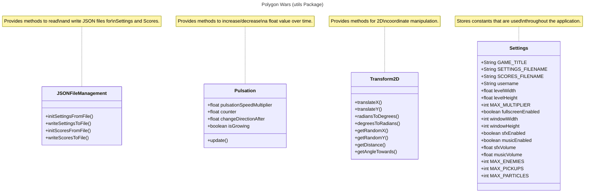

```mermaid
---
title: Polygon Wars (utils Package)
---
classDiagram
    class JSONFileManagement {
        +initSettingsFromFile()
        +writeSettingsToFile()
        +initScoresFromFile()
        +writeScoresToFile()
    }
    note for JSONFileManagement "Provides methods to read\nand write JSON files for\nSettings and Scores."

    class Pulsation {
        +float pulsationSpeedMultiplier
        +float counter
        +float changeDirectionAfter
        +boolean isGrowing

        +update()
    }
    note for Pulsation "Provides methods to increase/decrease\na float value over time."

    class Transform2D {
        +translateX()
        +translateY()
        +radiansToDegrees()
        +degreesToRadians()
        +getRandomX()
        +getRandomY()
        +getDistance()
        +getAngleTowards()
    }
    note for Transform2D "Provides methods for 2D\ncoordinate manipulation."

    class Settings {
        +String GAME_TITLE
        +String SETTINGS_FILENAME
        +String SCORES_FILENAME
        +String username
        +float levelWidth
        +float levelHeight
        +int MAX_MULTIPLIER
        +boolean fullscreenEnabled
        +int windowWidth
        +int windowHeight
        +boolean sfxEnabled
        +boolean musicEnabled
        +float sfxVolume
        +float musicVolume
        +int MAX_ENEMIES
        +int MAX_PICKUPS
        +int MAX_PARTICLES
    }
    note for Settings "Stores constants that are used\nthroughout the application."
```