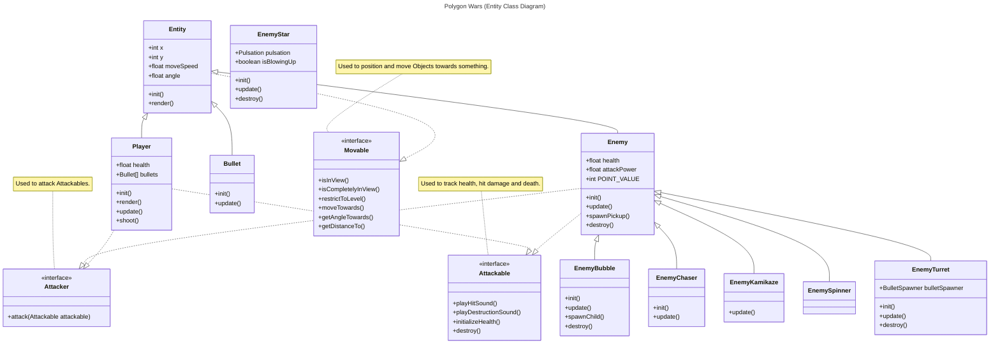

```mermaid
---
title: Polygon Wars (Entity Class Diagram)
---
classDiagram
Entity <|-- Player

Entity <|-- Enemy
Enemy <|-- EnemyBubble
Enemy <|-- EnemyChaser
Enemy <|-- EnemyKamikaze
Enemy <|-- EnemySpinner
Enemy <|-- EnemyTurret

Entity <|-- Bullet

Entity ..|> Movable
Enemy ..|> Attacker
Player ..|> Attacker
Player ..|> Attackable
Enemy ..|> Attackable

class Entity {
    +int x
    +int y
    +float moveSpeed
    +float angle
    +init()
    +render()
}

class Player {
    +float health
    +Bullet[] bullets
    +init()
    +render()
    +update()
    +shoot()
}

class Enemy {
    +float health
    +float attackPower
    +int POINT_VALUE
    +init()
    +update()
    +spawnPickup()
    +destroy()
}

class EnemyBubble {
    +init()
    +update()
    +spawnChild()
    +destroy()
}

class EnemyChaser {
    +init()
    +update()
}

class EnemyKamikaze {
    +update()
}

class EnemyStar {
    +Pulsation pulsation
    +boolean isBlowingUp
    +init()
    +update()
    +destroy()
}

class EnemyTurret {
    +BulletSpawner bulletSpawner
    +init()
    +update()
    +destroy()
}

class Bullet {
    +init()
    +update()
}

note for Movable "Used to position and move Objects towards something."
class Movable {
    <<interface>>
    +isInView()
    +isCompletelyInView()
    +restrictToLevel()
    +moveTowards()
    +getAngleTowards()
    +getDistanceTo()
}

note for Attackable "Used to track health, hit damage and death."
class Attackable {
    <<interface>>
    +playHitSound()
    +playDestructionSound()
    +initializeHealth()
    +destroy()
}

note for Attacker "Used to attack Attackables."
class Attacker {
    <<interface>>
    +attack(Attackable attackable)
}
```